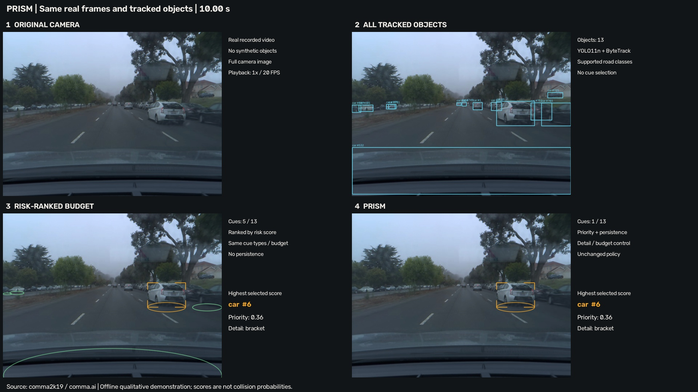

# Real driving demonstration

The 60-second comma2k19 example is processed with YOLO11n, ByteTrack, PRISM temporal state and the default cue policy. Both videos contain 1200 frames at the acquisition rate of 20 FPS. The four-panel comparison shows the original image, all tracked boxes, risk-budget selection, and PRISM on identical observations.

[Watch or download the comparison video](https://github.com/dugu/prism/releases/download/real-driving-v1/PRISM_real_driving_comparison.mp4) · [PRISM overlay video](https://github.com/dugu/prism/releases/download/real-driving-v1/PRISM_real_driving.mp4)

[](https://github.com/dugu/prism/releases/download/real-driving-v1/PRISM_real_driving_comparison.mp4)

## Recorded data

`recorded/frame_records.jsonl.gz` contains every frame's tracked boxes, confidence, identities, estimated state, PRISM/risk-budget decisions, and three timing fields. `summary.json`, `analysis.json`, `environment.json`, and `verification.json` provide the supporting results and execution record. No ground-truth object or hazard labels are supplied for this demonstration.

| Output | Mean objects/cues | Identity additions and removals/s |
|---|---:|---:|
| All tracked objects | 6.62 | See analysis.json |
| Risk-budget selection | 4.66 | 23.32 |
| PRISM | 0.78 | 2.72 |

PRISM shows no cue in 509 of 1200 frames. Fewer cues do not establish that relevant hazards were retained. The video includes false detections of the recording vehicle: at 20.25 seconds, a car-labelled box on the lower-image body/interior has confidence 0.483, estimated depth 5.51 m, and priority 0.244. It passes PRISM's 0.24 activation threshold and is displayed as a tick. The current pipeline does not include a camera-specific ego-vehicle mask. The geometric lower-image screen in `analysis.json` is a post-hoc diagnostic, not a false-positive ground-truth set.

Recorded state/scoring and allocation intervals together average 0.117 ms on the Apple M5 CPU, versus 28.903 ms for detection plus tracking, after omitting frames 0–19 descriptively. Decoding, rendering, encoding, and physical display are excluded. This is a local offline run, separate from the virtualised Xeon backend benchmark; normal-speed playback does not establish real-time deployment.

## Reproduce

From the repository root, verify every saved state and policy decision using the lightweight dependencies:

```sh
python demos/real_driving/verify_demo.py --decisions-only
python demos/real_driving/analyze_records.py
```

For video generation, create an isolated Python 3.12 environment. The full lock file records the macOS run; wheels and numerical detector output can differ on another platform.

```sh
python -m venv .venv-video
source .venv-video/bin/activate
pip install -r demos/real_driving/requirements-lock.txt
python demos/real_driving/download_inputs.py
python demos/real_driving/make_demo.py --replay
python demos/real_driving/verify_demo.py
```

Omit `--replay` to run detector inference again. Generated outputs go in the ignored `output/` directory. Replay uses the committed compressed decisions unless local inference records exist there. The downloader verifies the source video and YOLO11n weight hashes. The weight hash equals the experiment manifest's YOLO11n hash.

The full source image is processed without cropping or masking. The supplied timestamps drive state estimation. The elementary HEVC stream can be reported as 25 FPS, but its timestamp spacing is approximately 0.05 s. The supplied camera intrinsics are fx = fy = 910 px, principal point (582,437), and frame size 1164 x 874. The inference uses nominal size 640, confidence 0.25, and the default ByteTrack configuration; upstream filtering means the tracker's low-score recovery band below 0.25 receives no detections.

## Source and attribution

The official [comma.ai comma2k19 repository](https://github.com/commaai/comma2k19) supplies the example segment `Example_1/b0c9d2329ad1606b|2018-08-02--08-34-47/40/`. It was chosen for public accessibility, camera metadata, and visible traffic before running PRISM. `source/source.json` pins the upstream commit and paths. The original clip and pretrained model are retrieved from their upstream locations, not embedded in the Git history.

Copyright (c) 2018 comma.ai. The upstream MIT license is preserved in [source/LICENSE-comma2k19.txt](source/LICENSE-comma2k19.txt) and in the video release. Retain that notice and license with redistribution. Dataset reference: Schafer, H.; Santana, E.; Haden, A.; Biasini, R. *A Commute in Data: The comma2k19 Dataset*, 2018, https://arxiv.org/abs/1812.05752.

PRISM's monocular depth and TTC are heuristic estimates, not validated hazard probabilities. Camera calibration does not by itself validate class-height priors or compensate for wipers, occlusion, reflections, or identity changes. No safety superiority or measured driver benefit is claimed.
